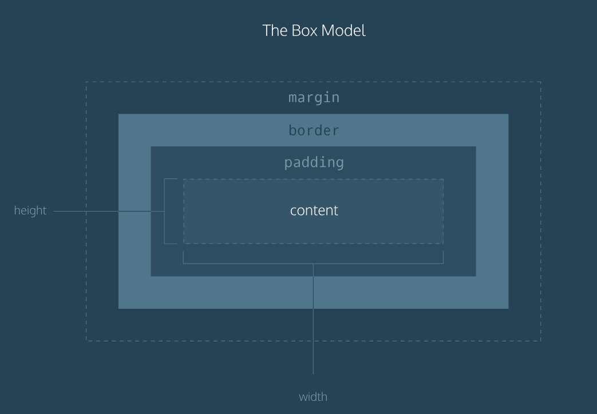
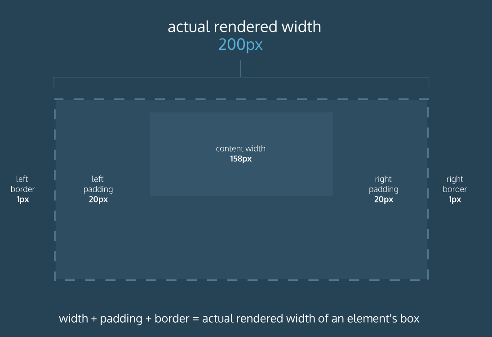
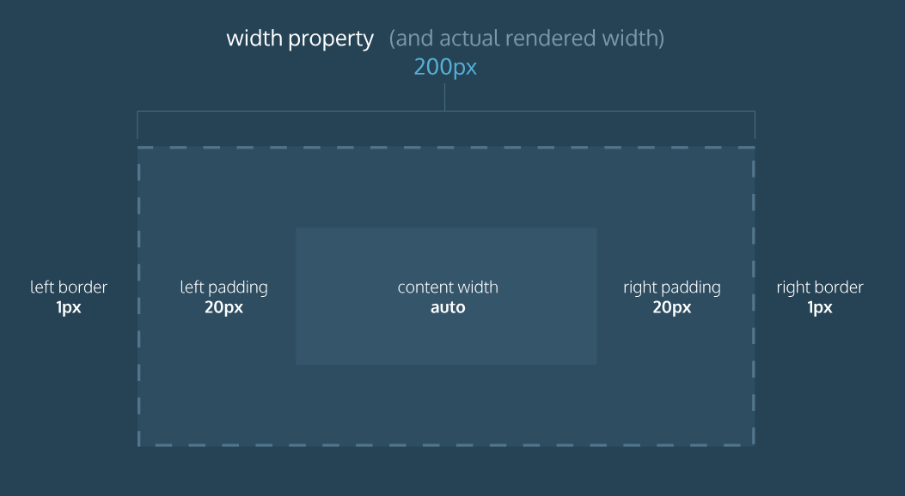

# CSS Setup and Selectors

## Inline style
```
<p style="color: red; font-size: 20px;">I'm learning to code!</p>
```
* Simply keep adding to the style attribute. 
* Make sure to end the styles with a semicolon (`;`).

## The <style> Tag
```
<head>
  <style>
    p {
      color: red;
      font-size: 20px;
    }
  </style>
</head>
```
* Write the `<style>` tage inside the `<head>`.

## The .css file
* Create a CSS file by using the .css file name extension, like so: style.css

## Linking the CSS File
```
<link href="https://www.codecademy.com/stylesheets/style.css" type="text/css" rel="stylesheet">
```
* Use the `<link>` tag
If in the same direction, use relative path:
```
<link href="./style.css" type="text/css" rel="stylesheet">
```

## CSS selector
### Select by tag name
```
p {

}
```
### Select by class
```
<p class="brand">Sole Shoe Company</p>
```
```
.brand {

}
```

### Select by multiple classes
```
<h1 class="green bold"> ... </h1>
```
```
.green {
  color: green;
}

.bold {
  font-weight: bold;
}
```

### Select by ID name
```
<h1 id="large-title"> ... </h1>
```
```
#large-title {

}
```

## Specificity
* ID > class > tag
* A best practice in CSS is to style elements while using the lowest degree of specificity, so that if an element needs a new style, it is easy to override.
* If it is possible to use tag, use it. Then consider for class and finally ID.

## Chainning selector
```
h1.special {

}
```
* Select only the `h1` elements that have a class of `special`
* Do not have space between `h1` and `.special`

## Nested elements
```
<ul class='main-list'>
  <li> ... </li>
  <li> ... </li>
  <li> ... </li>
</ul>
```
```
.main-list li {

}
```
* All nested `<li>` elements are selected
* Notice the space between `.main-list` and `li`
* There are four different combinators in CSS:
  * descendant selector (space): all children.
  * child selector (>) : immediate children.
  * adjacent sibling selector (+) :  adjacent siblings.
  * general sibling selector (~) : just sblings.


## Important
`!important` can be applied to specific attributes instead of full rules. 
```
p {
  color: blue !important;
}


.main p {
  color: red;
}
```
* The `!important` flag is only useful when an element appears the same way 100% of the time. 
* It's best to avoid !important altogether. 
* If you ever see !important used (or are ever tempted to use it yourself) we strongly recommend reorganizing your CSS. 
* Making your CSS more flexible will typically fix the immediate problem and make your code more maintainable in the long run.

## Multiple Selectors
```
h1, 
.menu {
  font-family: Georgia;
}
```
* Prevent to write repetive code

## Summary for CSS selectors
* CSS can change the look of HTML elements. In order to do this, CSS must select HTML elements, then apply styles to them.
* CSS can select HTML elements by tag, class, or ID.
* Multiple CSS classes can be applied to one HTML element.
* Classes can be reusable, while IDs can only be used once.
* IDs are more specific than classes, and classes are more specific than tags. That means IDs will override any styles from a class, and classes will override any styles from a tag selector.
* Multiple selectors can be chained together to select an element. This raises the specificity, but can be necessary.
* Nested elements can be selected by separating selectors with a space.
* The !important flag will override any style, however it should almost never be used, as it is extremely difficult to override.
* Multiple unrelated selectors can receive the same styles by separating the selector names with commas.


# CSS Visual Rules
## Font Family
* Default value: Times New Roman
* Limit the number of typefaces used on a web page to 2 or 3. It will impact the load speed.
* Use `""` when it contains more than one word.
## Font Size
```
p {
  font-size: 18px;
}
```
## Font Weight
```
p {
  font-weight: bold;
}
```
* Options: `bold`, `normal`
## Text Align
```
h1 {
  text-align: right;
}
```
* Options: `left`, `center`, `right`
## Color
* Foreground color
* Background color
```
h1 {
  color: red;
  background-color: blue;
}
```
## Opacity
```
.overlay {
  opacity: 0.5;
}
```
* 0 (invisible) ~ 1 (fully visible)

## Background Image
```
.main-banner {
  background-image: url("https://www.example.com/image.jpg");
}
```
* Need to use URL


# Some point that I conclude:
* The name of css attribute always use lowercase and `-` to split different words.
* For every CSS block, no need for `;`.
* For every attribute inside CSS block, need `;`.

## Summary for Visual Rules
* CSS declarations are structured into property and value pairs.
* The `font-family` property defines the typeface of an element.
* `font-size` controls the size of text displayed.
* `font-weight` defines how thin or thick text is displayed.
* The `text-align` property places text in the `left`, `right`, or `center` of its parent container.
* Text can have two different color attributes: `color` and `background-color`. `color` defines the color of the text, while `background-color` defines the color behind the text.
* CSS can make an element transparent with the `opacity` property.
* CSS can also set the background of an element to an image with the `background-image` property.

# Introduction to the Box Model
## The Box Model

* Width and height — specifies the width and height of the content area.
* Padding — specifies the amount of space between the content area and the border.
* Border — specifies the thickness and style of the border surrounding the content area and padding.
* Margin — specifies the amount of space between the border and the outside edge of the element.

## Height and Width
```
p {
  height: 80px;
  width: 240px;
}
```
* Pixels allow you to set the exact size of an element's box (width and height). 
* When the width and height of an element are set in pixels, it will be the same size on all devices — an element that fills a laptop screen will overflow a mobile screen.

## Borders
A border is a line that surrounds an element. Borders can be set with a specific `width`, `style`, and `color`.
```
p {
  border: 3px solid coral;
}
```
* Width: `thin`, `medium`, or `thick` or `px`. Default is `medium`
* Style: `none`, `dotted`, `dashed`, `solid`....

## Border Radius
Set the radius for border corner
```
div.container {
  border: 3px solid rgb(22, 77, 100);
  border-radius: 5px;
}
```
* 100% means circle.

## Padding
The padding is the space between the contents of a box and the borders of a box.
```
p.content-header {
  border: 3px solid coral;
  padding: 10px;
}
```
```
p.content-header {
  border: 3px solid grey;
  padding: 6px 11px 4px 9px;
}
```
* The order is top, right, bottom, left
```
p.content-header {
  padding: 5px 10px;
}
```
* The order is top & bottom, left & right

## Margins
```
p {
  border: 1px solid aquamarine;
  margin: 20px;
}
```
* The property of margin is similar with padding
* The `margin` property also lets you center content.
```
div {
  margin: 0 auto;
}
```
* In order to center an element, a width must be set for that element. Otherwise, the width of the div will be automatically set to the full width of its containing element, like the <body>, for example. It's not possible to center an element that takes up the full width of the page.

## Margin Collapse
* Horizontal margin are added but vertical margins are not.
* Instead, the larger of the two vertical margins sets the distance between adjacent elements.


## Minimum and Maximum Height and Width
Ensure the minimum or maximum size of an element.
```
p {
  min-width: 300px;
  max-width: 600px;
}
```
* In the example above, the width of all paragraphs will not shrink below 300 pixels, nor will the width exceed 600 pixels.
```
p {
  min-height: 150px;
  max-height: 300px;
}
```
* Similar for `min-height` or `max-height`.

## Overflow
The size of the element is larger than its parent.
```
p {
  overflow: scroll; 
}
```
* The overflow property controls what happens to content that spills, or overflows, outside its box. It can be set to one of the following values:

  * `hidden` - when set to this value, any content that overflows will be hidden from view.
  * `scroll` - when set to this value, a scrollbar will be added to the element's box so that the rest of the content can be viewed by scrolling.
  * `visible` - when set to this value, the overflow content will be displayed outside of the containing element. Note, this is the default value.

## Resetting Defaults
Reset the default stylesheet
```
* {
  margin: 0;
  padding: 0;
}
```
## Visibility
* `hidden` — hides an element.
* `visible` — displays an element.
```
.future {
  visibility: hidden;
}
```
* What's the difference between `display: none` and `visibility: hidden`?
  * An element with `display: none` will be completely removed from the web page.
  * An element with `visibility: hidden`, however, will not be visible on the web page, but the space reserved for it will.
  
## Summary for Box Model
* The box model comprises a set of properties used to create space around and between HTML elements.
* The height and width of a content area can be set in pixels or percentage.
* Borders surround the content area and padding of an element. The color, style, and thickness of a border can be set with CSS properties.
* Padding is the space between the content area and the border. It can be set in pixels or percent.
* Margin is the amount of spacing outside of an element's border.
* Horizontal margins add, so the total space between the borders of adjacent elements is equal to the sum of the right margin of one element and the left margin of the adjacent element.
* Vertical margins collapse, so the space between vertically adjacent elements is equal to the larger margin.
margin: 0 auto horizontally centers an element inside of its parent content area, if it has a width.
* The overflow property can be set to display, hide, or scroll, and dictates how HTML will render content that overflows its parent's content area.
* The visibility property can hide or show elements.

# Why Change the Box Model?
Under this box model, the border thickness and padding are added to the overall dimensions of the box. This makes it difficult to accurately size a box. Over time, this can also make all of a web page's content difficult to position and manage.

## Box Model: Content-Box
The default box model used by the browser


## Box Model: Border-Box
Fortunately, we can reset the entire box model and specify a new one: `border-box`.
```
* {
  box-sizing: border-box;
}
```

* In this box model, the height and width of the box will remain fixed. The border thickness and padding will be included inside of the box, which means the overall dimensions of the box do not change.

# Flow of HTML
## Position
### static - the default value (it does not need to be specified)

### relative
This value allows you to position an element relative to its default static position on the web page.
```
.box-bottom {
  background-color: DeepSkyBlue;
  position: relative;
  top: 20px;
  left: 50px;
}
```

### absolute
When an element's position is set to absolute all other elements on the page will ignore the element and act like it is not present on the page. The element will be positioned relative to its closest positioned parent element.
### fixed
Fix the element position on the page.

## Z-Index
```
.box-top {
  background-color: Aquamarine;
  position: relative;
  z-index: 2;
}

.box-bottom {
  background-color: DeepSkyBlue;
  position: absolute;
  top: 20px;
  left: 50px;
  z-index: 1;
}
```
* The `z-index` property controls how far "back" or how far "forward" an element should appear on the web page when elements overlap.
* The larger value, the toper.

## Inline Display
Inline elements have a box that wraps tightly around their content
```
h1 {
  display: inline;
}
```

## Block Display
Block-level elements fill the entire width of the page by default, but their width property can also be set. 
```
strong {
  display: block;
}
```

## Inline-Block Display
Inline-block elements can appear next to each other and we can specify their dimensions using the width and height properties. Images are the best example of default inline-block elements.
```
.rectangle {
  display: inline-block;
  width: 200px;
  height: 300px;
}
```
* The difference with inline: can set the width and height.
* The difference with block: can set in one line.

## Float
* The float property can be set to one of two values:
  * left - this value will move, or float, elements as far left as possible.
  * right - this value will move elements as far right as possible.
```
.box-bottom {
  background-color: DeepSkyBlue;
  float: right;
}
```
* Floated elements must have a width specified, as in the example above. Otherwise, the element will assume the full width of its containing element, and changing the float value will not yield any visible results.

## Clear
The clear property specifies how elements should behave when they bump into each other on the page. It can take on one of the following values: left, right, both, none
```
div {
  width: 200px;
  float: left;
}

div.special {
  clear: left;
}
```

# Introduction to Color
